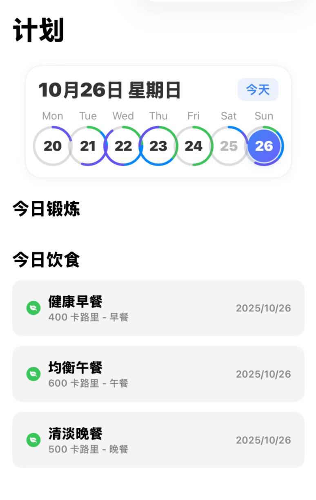

# 健身应用功能分析

本文档根据项目结构对健身应用的功能进行分析。

## 1. 核心架构

- **UI 框架：** SwiftUI
- **架构：** 项目遵循模型-视图-视图模型（MVVM）架构，这通过 `Models`、`Views` 和 `ViewModels` 目录的分离可以看出。
- **数据持久化：** 应用使用 SwiftData 进行本地数据存储，其中 `HealthMetric` 是一个核心的 `@Model`。
- **依赖管理：** 使用 Swift 包管理器（Swift Package Manager）来管理外部库。

## 2. 主要功能

### 2.1. 新用户引导 (`Onboarding`)
- 为新用户提供多步骤的引导流程 (`OnboardingFlowView`)。
- 步骤包括：欢迎屏幕、安全检查、目标选择、经验水平和锻炼地点。

### 2.2. 仪表盘 (`Dashboard`)
- 应用的中心枢纽 (`SummaryDashboardView`)。
- **健身圆环 (`ActivityRingView`)：** 每日健身目标的视觉表示。
- **指标卡片 (`Metrics Cards`)：** 显示步数、距离、当前体重/目标进度等关键指标 (`StepsCard`, `DistanceCard`, `CurrentCardView`, `GoalProgressView`)。
- **图表 (`Charts`)：** 用于可视化步数和距离历史的条形图 (`StepBarChart`, `DistanceBarChart`)。
- **最近活动 (`Recent Activity`)：** 最近的锻炼或数据条目列表 (`RecentActivityCard`, `HistoryListView`)。
- **挑战 (`Challenges`)：** 每月挑战卡片 (`MonthlyChallengeCard`)。
- **自定义 (`Customization`)：** 用户可以编辑仪表盘布局 (`EditDashboardView`)。

### 2.3. 用户个人资料 (`Profile`)
- 一个全面的用户个人资料部分 (`ProfileView`)。
- **设置 (`Settings`)：**
    - 基本信息 (`BasicInfoSettingsView`)
    - 外观/主题 (`AppearanceSettingsView`)
    - 健康目标 (`HealthGoalsSettingsView`)
    - 通知 (`NotificationSettingsView`)
    - 数据与隐私 (`DataPrivacySettingsView`)
- **数据可视化 (`Data Visualization`)：**
    - 身体数据 (`BodyDataView`)
    - 营养 (`NutritionView`)
    - 训练偏好 (`TrainingPreferenceView`)
    - 器材列表 (`EquipmentListView`)

### 2.4. 锻炼与计划管理 (`Plan`)
- 用户可以创建、查看和管理锻炼计划 (`PlanView`)。
- **计划详情 (`Plan Details`)：** 计划和每日锻炼的详细视图 (`PlanDetailView`, `DayDetailCardView`)。
- **计划设置 (`Plan Setup`)：** 用于创建新锻炼计划的流程 (`PlanSetupView`)。
- **历史记录 (`History`)：** 查看过去的锻炼计划 (`PlanHistoryView`)。

### 2.5. 数据输入与跟踪 (`Data Input & Tracking`)
- **手动输入表单 (`Manual Input Sheet`)：** 用于输入各种健康指标的专用表单 (`InputSheetView`)。
- **专用滑块 (`Specialized Sliders`)：** 用于输入体重、体脂和腰围的自定义滑块。
- **身体指标 (`Body Metrics`)：** 用于跟踪身体指标的专用视图 (`BodyMetricsView`)。

### 2.6. 统计与报告 (`Statistics and Reporting`)
- **统计视图 (`Stats View`)：** 用于查看健康统计数据的专用部分 (`StatsView`)。
- **报告 (`Reports`)：** 详细的报告，可能包含图表和摘要 (`ReportView`)。
- **日历视图 (`Calendar View`)：** 用于随时间可视化数据的日历 (`CalendarView`, `MonthView`)。

### 2.7. 系统集成 (`System Integration`)
- **HealthKit：** 与苹果的 HealthKit 集成，以读取和写入健康数据 (`HealthKitManager`)。
- **通知 (`Notifications`)：** 用于提醒或成就的本地通知 (`NotificationManager`)。
- **触觉反馈 (`Haptics`)：** 用户交互时的自定义触觉反馈 (`View+Haptic`)。

### 2.8. 小组件扩展 (`Widget Extension`)
- 一个主屏幕小组件，用于显示与体重相关的信息 (`WeightWidgets`)。
- 无需打开应用即可快速浏览数据。

## 3. 数据模型 (`Models/`)
- `HealthMetric`: 用于存储时间序列健康数据（如体重、步数）的核心模型。
- `UserProfile`: 存储用户特定信息和偏好。
- `Plan`: 代表一个锻炼计划。
- `Workout`: 代表单个锻炼会话。
- `Meal`: 可能用于营养跟踪。
