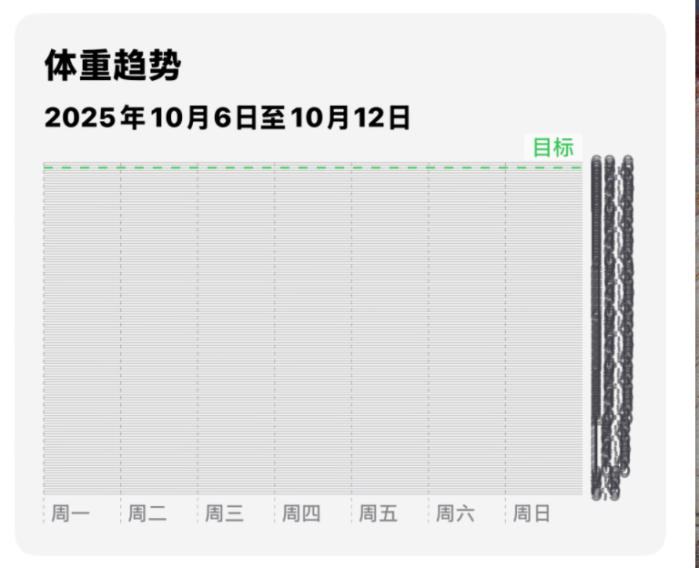

# 产品需求文档 (PRD): 应用导航与核心功能区重构 V3.0

**文档版本:** 3.0
**发布日期:** 2025-10-15
**负责人:** (产品经理)
**状态:** 需求已确认

---

## 1. 背景与目标

### 1.1. 项目背景
随着应用功能的迭代，当前的信息架构存在潜在的功能重叠（尤其在数据分析层面）和导航层级不够清晰的问题。为了支撑未来的功能扩展（特别是社交系统）并持续优化用户体验，有必要对应用的核心导航和功能区进行一次彻底的重构。

### 1.2. 核心目标
本次重构旨在建立一个职责清晰、逻辑自洽、可扩展性强的应用信息架构。
- **提升用户体验:** 优化导航，让用户能根据直觉快速定位功能，降低认知负荷。
- **明确功能定位:** 严格区分“身体指标”与“运动统计”等核心概念，避免用户混淆。
- **支撑未来发展:** 为即将引入的“社交系统”等新功能模块提供独立的成长空间。

## 2. 成功指标 (Success Metrics)

- **任务成功率:** 新用户在30秒内找到并进入“外观设置”页面的成功率 > 95%。
- **导航准确率:** 用户首次点击“身体档案”或“统计”标签页的意图准确率（通过后续行为判断）提升20%。
- **用户满意度:** 新版本发布后，应用商店关于“界面清晰”、“好用”等正面评论占比提升15%。
- **功能使用率:** “身体档案”和“统计”标签页的月活跃用户（MAU）渗透率均达到80%以上。

## 3. 用户故事 (User Stories)

- **张伟 (数据导向者):** “作为一名严格控制体脂的用户，我希望能在一个专属页面上，一目了然地看到我的体重、体脂率和围度的长期变化曲线，从而快速判断我的饮食和训练策略是否有效。”
- **李娜 (运动表现派):** “作为一名跑者，我关心的是我的运动表现。我希望能方便地回顾我上个月跑了多少次、总距离多长、平均配速有没有提高，以便调整我的训练计划。”
- **小明 (新用户):** “作为一名新用户，我想把App的主题色换成我喜欢的绿色。我期望这个设置功能应该在某个总的‘设置’或‘个人中心’里，而不是散落在其他功能页面。”

---

## 4. 核心功能详述

### 4.1. 总体信息架构
应用将采用“底部五标签页 + 顶部设置入口”的混合导航模式。

### 4.2. 底部导航栏 (Bottom Tab Bar)
应用底部常驻五个标签页，作为一级导航。

#### 4.2.1. 概览 (Overview)
- **定位:** App的启动页和每日仪表盘，是用户每日健康生活的缩影。
- **核心功能:**
    - 聚合展示当日最关键的动态信息（如健身圆环、步数、距离）。
    - 提供最近活动（如上次锻炼、最近的体重记录）的快捷入口。

#### 4.2.2. 计划 (Plan)
- **定位:** 用户的行动规划与执行中心。
- **核心功能:**
    - 创建、管理和执行结构化的锻炼与饮食计划。
    - 以日历和周视图的形式，清晰展示计划任务。
    - 提供历史计划的归档与回顾功能。

#### 4.2.3. 身体档案 (Body Profile)
- **定位:** 用户的“身体说明书”，严格聚焦于**身体本身**的物理指标和形态变化。
- **核心功能:**
    - **核心指标仪表盘:** 置顶展示体重、体脂率、BMI等当前关键数据。
    - **交互式趋势图表:** 提供强大的图表工具，供用户自由探索身体围度、身体成分等指标的长期变化。
    - **视觉记录:** 支持用户上传、管理和对比不同时期的体型照片。
    - **快捷数据录入:** 通过悬浮操作按钮（FAB）快速唤起输入面板。
- **回答的问题:** “我的身体变成了什么样？”

#### 4.2.4. 统计 (Stats)
- **定位:** 用户的“健身行为日志”，严格聚焦于**运动过程**的数据和表现分析。
- **核心功能:**
    - **运动表现分析:** 深入分析跑步配速、力量训练PR、心率区间等表现类数据。
    - **训练数据汇总:** 按时间维度（周/月/年）统计训练频率、总时长、总容量、热量消耗等。
- **回答的问题:** “我最近的努力程度和运动能力如何？”

#### 4.2.5. 好友 (Friends)
- **定位:** 社交与社区中心，提供外部激励，增强用户粘性。
- **核心功能 (V3.0范围):**
    - 仅实现一个占位视图页面，告知用户此功能即将上线。
    - 页面UI需包含品牌插画和引导性文案。
- **核心功能 (远期规划):**
    - 好友动态流、成就点赞与评论、排行榜、社区挑战等。

### 4.3. 顶层设置入口
- **入口:** `概览` 页面的右上角，使用一个标准的用户头像或齿轮图标。
- **目标页面:** `个人资料与设置` (Profile & Settings)
- **定位:** App的全局“**控制中心**”，负责所有非核心功能的配置与管理。
- **核心功能:**
    - **账户管理:** 个人基本信息（昵称、头像、ID）。
    - **应用设置:** 外观（主题色）、通知、语言等。
    - **数据管理:** 数据与隐私设置、HealthKit连接管理、数据导出。
    - **其他:** 关于我们、帮助与反馈、服务条款等。

---

## 5. V3.0版本范围

### 5.1. 包含 (In Scope)
- **导航重构:** 完整实现新的五标签页导航结构。
- **页面拆分:**
    - 将原有的数据分析功能，按新定位拆分并分别置于“身体档案”和“统计”页。
    - 将所有设置类功能，统一收归到新的“个人资料与设置”页面。
- **占位符页面:** 创建“好友”标签页的占位符视图。

### 5.2. 暂不包含 (Out of Scope)
- “好友”标签页内任何实质性功能的开发（如动态流、排行榜等）。
- “身体档案”与“统计”页面之间的数据关联分析（例如，在体重图表上自动标注高强度训练日）。

## 6. 设计与UX思考
- **图标设计:** 底部标签页的图标需有高区分度，能准确传达页面核心功能。
- **空状态设计:** 需为“身体档案”、“统计”等页面的初次使用设计引导式空状态。
- **一致性:** 确保数据录入（如悬浮按钮）和页面跳转（如进入设置）的交互方式在应用内保持一致。
