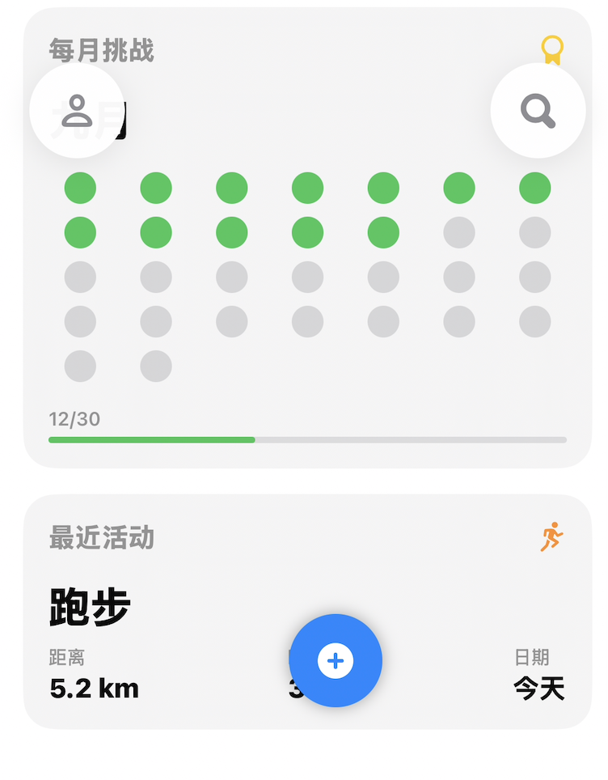

# Fitness Tracker - 产品需求文档 v2.1

---

## Part 1: 产品愿景与设计哲学 (The "Why")

这份文档的核心指导思想，源于我们对App灵魂的五层追问。它定义了我们为什么做、我们是谁，以及我们希望带给用户怎样的独特感受。

### 1️⃣ 存在意义：我们为什么做这个App？

*   **核心回答**：我们致力于通过记录与陪伴，满足用户在追求健康过程中的 **全面身心需求和感受**。
*   **更高目标**：我们希望用户在通往健康的旅途中，能充分享受 **美好生活和当下时刻的人生**。
*   **核心灵魂宣言**：

    > “陪伴用户书写一段段身心成长的旅程，在每一个当下积累健康的能量，让人生更美好。”

### 2️⃣ 世界观：App的人格是什么？

*   **统一人格**：App的主体人格为 **温暖陪伴型 / 成长画本旁白**。它是一位忠实的伙伴，以温柔的口吻，为用户的成长旅程提供注脚。
*   **人格细节差异化**：为增强代入感，App的文案风格可根据用户的 **MBTI或星座** 进行微调，使其更贴近用户的情绪和性格。

### 3️⃣ 情感内核：我们如何传递温度？

*   **留白**：
    *   **UI/布局留白**：视觉不拥挤，突出核心视觉元素，为用户提供呼吸感。
    *   **功能留白**：不强制用户每日记录或展示所有指标，允许用户按自己的节奏前进。
*   **情感温度**：
    *   **文案**：始终保持温柔，理解用户的每一次停顿或小小的“失败”。
    *   **视觉**：通过插画、动画和微交互，传递细腻的情感反馈。

### 4️⃣ 故事感：我们如何与用户共鸣？

*   **核心概念**：我们将用户的整个健身体验，包装成一本 **“私人健身旅程画本”**。
*   **结构设计**：章节感、插画化呈现、文字叙事。
*   **延伸玩法**：导出画册、年度成长回顾、社交分享。

### 5️⃣ 体验感：我们如何打磨细节？

*   **细节打磨**：所有动效、视觉和文案都需服务于“温暖陪伴”的人格。
*   **仪式感**：通过动画、音效、触觉反馈，强化“翻开画本”、“写入新一页”、“达成成就”等关键时刻的体验。

---

## Part 2: 核心功能需求 (The "What")

基于“私人健身旅程画本”的核心概念，我们将App的核心功能重构如下：

### 1. 概览页 (画本封面)
概览页是用户每日打开画本看到的第一页，是今日旅程的缩影。

*   **核心卡片**：健身圆环、目标进度、步数、距离等，以统一的卡片样式动态陈列。
*   **快捷入口**：
    *   右上角**设置入口**：点击进入“设置”页面。
    *   **编辑卡片**：允许用户自定义概览页的卡片顺序和显示/隐藏。

### 2. 计划页 (旅程规划)
此页面用于规划未来的旅程章节，目前包含锻炼和饮食的示例列表。

### 3. 统计页 (回顾篇章)
此页面用于回顾和分析过往的旅程，提供多时间维度的图表和数据分析，并支持分享。

### 4. 设置页 (画本设置)
由概览页右上角入口进入，提供对App的全面配置。

*   **导航列表**：页面采用标准的导航列表样式，分为不同区块。
*   **功能分区**：个人资料、健康与目标、通知、外观设置、数据与隐私、支持与反馈。

---

## Part 3: UI/UX 与技术规范 (The "How")

### 1. UI/UX 设计规范

*   **整体风格**：简洁、干净，有呼吸感。通过圆角、阴影和背景层次来构建视觉秩序。
*   **色彩方案**：
    *   **主背景**：`systemGroupedBackground` (浅灰色)。
    *   **卡片背景**：`secondarySystemGroupedBackground` (白色/深灰色)。
    *   **主题色**：`accentColor`，用户可在设置中更换，默认为蓝色。
*   **字体规范**：遵循Apple Human Interface Guidelines，通过字重和大小区分信息层级。
*   **动效**：所有过渡动画都应平滑、自然。

### 2. 技术架构

*   **框架**：SwiftUI
*   **数据管理**：HealthKit, `UserDefaults` (`@AppStorage`), `@StateObject`, `@EnvironmentObject`.
*   **图表库**：Swift Charts
*   **动画**：SwiftUI 原生动画系统。

---

## Part 4: 开发迭代与衡量指标 (Roadmap & Metrics)

*此部分保留了项目早期的详细规划，用于追踪长期目标和衡量标准。*

### 1. 开发迭代计划

#### Phase 1 - MVP版本（4-6周）
*   **核心功能**：体重记录、基础数据展示、简单趋势图表、底部导航、主题界面。
*   **交付标准**：完整的体重记录和展示功能，符合设计规范的UI，基础数据持久化。

#### Phase 2 - 扩展版本（6-8周）
*   **新增功能**：体脂率、围度等身体指标，运动时长记录，卡路里消耗计算，目标设定。
*   **优化内容**：图表交互，数据录入体验，性能。

#### Phase 3 - 专业版本（8-10周）
*   **高级功能**：详细运动数据（配速、心率），力量训练记录，智能分析和建议，数据导出和分享。
*   **技术升级**：复杂图表支持，数据分析算法，云端同步。

#### Phase 4 - 完整版本（10-12周）
*   **完善功能**：健身计划制定，成就系统，社交功能（可选），高级数据分析。

### 2. 验收标准

*   **功能验收**：所有核心功能正常运行，数据准确，性能良好，持久化稳定。
*   **设计验收**：UI符合设计规范，动画流畅，适配不同设备。
*   **性能验收**：启动时间 < 3秒，页面切换流畅（60fps），内存和电池使用合理。
*   **兼容性验收**：支持目标系统版本，主流设备，深色/浅色模式切换。

### 3. 成功指标

*   **用户体验指标**：易用性（新用户成功率 > 90%），留存率（7天 > 60%，30天 > 40%），满意度（应用商店评分 > 4.5星）。
*   **功能使用指标**：记录频率（每周 > 3次），功能覆盖（80%用户使用 > 2个核心功能），数据完整性（> 95%）。
*   **技术性能指标**：崩溃率 < 0.1%，响应时间 < 1秒，数据同步成功率 > 99%。

### 4. 后续迭代方向

*   **功能扩展**：营养记录、睡眠质量、心理健康、更多智能穿戴设备集成。
*   **社交功能**：好友系统、挑战、社区论坛。
*   **人工智能**：个性化训练建议、智能目标推荐、异常数据预警、健康风险评估。

---

*本文档版本：v2.1*

