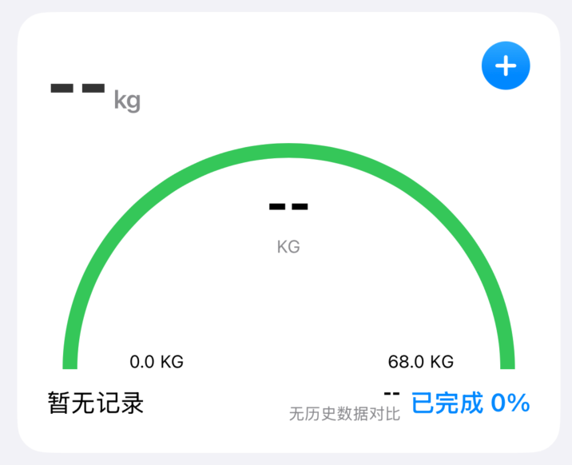

# 全面健身App产品需求文档

## 📋 项目概述

### 项目名称
**FitnessTracker** - 全面健身数据记录与分析应用

### 项目背景
从简单的体重记录应用发展为全面的健身数据追踪平台，帮助用户记录、分析和管理各种健身相关数据。

### 目标用户
- **主要用户**：关注健康和健身的个人用户
- **次要用户**：健身初学者、专业健身爱好者
- **使用场景**：日常健身数据记录、进度追踪、健康管理

### 产品定位
一款专注于数据可视化和用户体验的个人健身助手，提供简洁直观的界面和强大的数据分析功能。

---

## 🎯 核心功能需求

### 1. 首页仪表盘（摘要页面）

#### 1.1 健身圆环模块
- **功能描述**：圆环设计，展示活动卡路里进度
- **核心元素**：
  - 活动圆环：显示当前消耗卡路里 vs 目标卡路里
  - 动态进度：圆环进度随数据实时更新（SVG动画实现）
  - 数值显示：`当前消耗/目标消耗` 格式（320/500千卡）
  - 完成度提示：百分比显示和状态文字
- **交互要求**：1秒延迟的平滑进度动画效果

#### 1.2 数据统计网格（2x2布局）
- **步数卡片**：
  - 今日步数统计（8,520步）
  - 7天步数趋势的迷你柱状图（动态高度）
  - 紫色主题色彩（#8B5CF6）
- **步行距离卡片**：
  - 今日步行距离（2.15公里）
  - 历史距离趋势图（青色柱状图）
  - 青色主题色彩（#06B6D4）
- **活跃时间卡片**：
  - 今日活跃时间（45分钟）
  - 橙色主题色彩（#F97316）
- **静息心率卡片**：
  - 当前静息心率（72 BPM）
  - 粉色主题色彩（#EC4899）

#### 1.3 快速记录区域（3x2网格）
- **快捷按钮**：体重、跑步、游泳、力量、心率、更多
- **视觉设计**：彩色背景圆角图标 + 白色标签文字
- **交互反馈**：hover背景变化和点击响应

#### 1.4 成就预览模块
- **显示内容**：最新2个成就项目
- **成就类型**：连续记录、运动时长、挑战完成
- **进度展示**：进度条可视化（绿色填充）
- **交互功能**：点击进入完整成就页面

### 2. 记录功能页面

#### 2.1 数据记录分类
**身体指标类（2x2网格）**：
- 体重记录（蓝色，主要功能）
- 体脂率（灰色）
- 围度测量（灰色）
- 肌肉量（灰色）

**运动记录类（2x2网格）**：
- 跑步（绿色）
- 游泳（青色）
- 力量训练（紫色）
- 瑜伽（橙色）

#### 2.2 记录表单设计（预期功能）
- **智能表单**：根据运动类型动态显示相关字段
- **数据验证**：输入格式校验和合理性检查
- **快速输入**：常用数值的快捷选择
- **备注功能**：支持文字备注和图片上传

### 3. 数据分析页面

#### 3.1 时间维度切换
- **切换按钮**：7天、30天、3月、年度（选项卡设计）
- **默认选择**：7天（蓝色背景表示激活）
- **交互效果**：平滑的背景切换动画

#### 3.2 核心指标展示（2x2网格）
- **体重变化**：-1.2kg（绿色表示减少）
- **目标达成率**：85%（蓝色）
- **总卡路里**：2,340（紫色）
- **运动天数**：5（橙色）

#### 3.3 趋势图表
- **体重趋势图**：7天数据的动态柱状图
- **数据范围**：66-68kg区间可视化
- **动画效果**：500ms延迟的高度动画
- **交互标签**：周一到周日标识

#### 3.4 运动分析
- **运动类型分布**：跑步67%、游泳50%、力量训练33%
- **可视化方式**：水平进度条展示
- **颜色编码**：绿色、青色、紫色区分不同运动

#### 3.5 智能建议系统
- **进步评估卡片**：蓝色边框，本周运动频次提升20%
- **调整建议卡片**：黄色边框，建议增加力量训练
- **卡片设计**：透明背景+彩色边框+图标

#### 3.6 操作按钮
- **导出数据**：蓝色按钮，下载图标
- **分享报告**：灰色按钮，分享图标
- **布局**：等宽并排设计

### 4. 计划管理页面

#### 4.1 当前目标展示
- **目标卡片**：蓝紫渐变背景
- **目标内容**：减脂目标，65kg，2024年12月期限
- **进度可视化**：70%进度条（蓝白配色）

#### 4.2 训练计划列表
- **计划项目**：减脂训练（65%）、力量提升（30%）、晨间瑜伽（80%）
- **信息展示**：计划名称、类型、持续时间、完成度
- **进度条**：绿色填充，动态宽度

#### 4.3 本周计划状态
- **7天布局**：周一到周日垂直列表
- **状态指示**：
  - 已完成：绿色圆点（周一-周五）
  - 进行中：黄色圆点（周六）
  - 未开始：灰色圆点（周日）

#### 4.4 智能提醒开关
- **三类提醒**：训练提醒、记录提醒、休息日提醒
- **开关状态**：前两个开启（绿色），第三个关闭（灰色）
- **设计样式**：圆角切换开关，滑动动画

### 5. 个人中心页面

#### 5.1 个人信息卡片
- **头像区域**：渐变色圆形头像（蓝紫渐变）
- **用户信息**：健身达人，2年经验
- **统计数据**：186记录天数、28运动类型、125h总时长
- **布局**：头像+信息并排，下方3列统计

#### 5.2 成就系统展示
- **成就网格**：3x1布局展示3个主要成就
- **成就状态**：
  - 已完成：金色背景+白色图标
  - 未完成：灰色背景+灰色图标
- **进度显示**：成就名称+完成度数字

#### 5.3 数据统计模块
- **统计项目**：本月运动天数18天、平均每周4.5次、最佳记录8.5km
- **列表设计**：左侧描述+右侧数值的对齐布局

#### 5.4 应用设置列表
- **设置项目**：通知设置、数据管理、界面设置、账户安全
- **列表样式**：图标+文字+右箭头的标准列表项
- **交互效果**：hover时背景变灰

#### 5.5 帮助反馈区域
- **功能列表**：使用指南、常见问题、意见反馈
- **简化设计**：纯文字按钮，hover效果

---

## 🎨 UI/UX设计规范

### 1. 整体视觉风格

#### 1.1 色彩方案
- **主背景色**：深黑色 (#000000)
- **卡片背景**：深灰色 (#111827)
- **功能色彩**：
  - 红色：#EF4444（活动圆环）
  - 紫色：#8B5CF6（步数数据）
  - 青色：#06B6D4（距离数据）
  - 绿色：#10B981（成功状态、进度完成）
  - 蓝色：#3B82F6（主要操作按钮）
  - 橙色：#F97316（活跃时间）
  - 粉色：#EC4899（心率数据）

#### 1.2 文字规范
- **主标题**：白色，粗体，text-3xl（32px+）
- **卡片标题**：白色，半粗体，text-lg（18px）
- **数值显示**：彩色，粗体，text-xl/text-2xl
- **描述文字**：灰色 (#9CA3AF)，常规，text-sm
- **次要信息**：深灰色 (#6B7280)，text-xs

#### 1.3 组件样式
- **圆角规范**：rounded-xl (12px) 标准卡片，rounded-2xl (16px) 大卡片
- **间距系统**：space-y-6 主要间距，p-5 卡片内边距，p-4 小卡片内边距
- **阴影效果**：shadow-lg 配合颜色透明度实现发光效果

### 2. 底部导航设计

#### 2.1 纯图标导航特色
- **深色背景**：黑色80%透明度 + backdrop-blur-xl毛玻璃效果
- **去除文字**：仅使用图标，无任何文字标签
- **中央突出按钮**：
  - 正常状态：白色背景，灰色图标，w-14 h-14
  - 激活状态：绿色背景，白色图标，scale-110缩放
  - 悬停效果：hover:scale-105 + 发光阴影

#### 2.2 导航项目
- **摘要**：Home图标，主页仪表盘
- **分析**：BarChart3图标，数据分析
- **记录**：Plus图标，中央大按钮
- **计划**：Calendar图标，目标和计划  
- **我的**：User图标，个人中心

#### 2.3 交互动效
- **切换动画**：duration-200 平滑过渡
- **状态指示**：激活项目图标变白色
- **按压反馈**：transform缩放效果

---

## 📱 技术实现详情

### 1. React组件架构
- **主组件**：FitnessApp（状态管理+路由控制）
- **页面组件**：DashboardView、AnalyticsView、RecordView、PlanView、ProfileView
- **状态管理**：useState管理activeTab和模拟数据
- **时间更新**：useEffect + setInterval实现实时时钟

### 2. 数据结构设计

#### 2.1 核心数据模型
```javascript
// 今日统计数据
todayStats = {
  weight: 67.2,          // 当前体重
  bodyFat: 18.5,         // 体脂率
  calories: 320,         // 消耗卡路里
  steps: 8520,           // 今日步数
  targetCalories: 500,   // 目标卡路里
  distance: 2.15,        // 步行距离
  activeMinutes: 45,     // 活跃时间
  heartRate: 72          // 静息心率
}

// 周数据数组
weeklyData = [
  { day: 'Mon', calories: 450, steps: 9200, weight: 67.8 },
  // ...7天数据
]

// 成就数据
achievements = [
  { 
    id: 1, 
    title: '连续记录7天', 
    progress: 7, 
    total: 7, 
    icon: Target, 
    color: 'text-green-400' 
  }
  // ...更多成就
]

// 训练计划
workoutPlans = [
  { 
    id: 1, 
    name: '减脂训练计划', 
    type: '有氧为主', 
    duration: '4周', 
    progress: 65 
  }
  // ...更多计划
]
```

### 3. 动画实现方案

#### 3.1 CSS动画
- **进度圆环**：SVG的stroke-dasharray动画，1秒延迟
- **进度条**：width百分比变化，500ms过渡
- **按钮状态**：transform scale + 颜色过渡
- **页面切换**：淡入淡出效果

#### 3.2 交互反馈
- **hover效果**：bg-gray-800 背景变化
- **点击反馈**：active状态的视觉变化
- **状态切换**：颜色和图标的平滑过渡

---

## 🚀 开发迭代计划

### Phase 1 - MVP版本（当前实现状态）
**已完成功能**：
- ✅ 完整的5页面UI结构
- ✅ 纯图标底部导航
- ✅ 深色主题界面
- ✅ 健身圆环动画效果
- ✅ 数据统计卡片展示
- ✅ 快速记录入口
- ✅ 成就系统预览
- ✅ 分析页面数据可视化
- ✅ 计划管理界面
- ✅ 个人中心完整布局

**技术实现**：
- React函数组件 + Hooks
- Tailwind CSS样式系统
- Lucide React图标库
- 响应式布局设计
- 动态数据渲染

### Phase 2 - 功能实现版本（6-8周）
**待开发功能**：
- 数据记录表单实现
- 本地数据存储（localStorage）
- 图表交互功能
- 设置页面功能实现
- 数据导出功能

### Phase 3 - 完善版本（8-10周）
**高级功能**：
- 复杂数据分析算法
- 智能建议系统
- 数据同步功能
- 性能优化

### Phase 4 - 生产版本（10-12周）
**生产级功能**：
- 用户认证系统
- 云端数据存储
- 推送通知
- 应用发布准备

---

## ✅ 当前实现验收标准

### 1. UI界面验收
- ✅ 深色主题完整实现
- ✅ 5个页面布局完成
- ✅ 底部导航纯图标设计
- ✅ 响应式设计适配
- ✅ 动画效果流畅实现

### 2. 功能模块验收
- ✅ 页面切换功能正常
- ✅ 数据展示组件工作正常
- ✅ 交互反馈效果完整
- ✅ 时间显示实时更新

### 3. 代码质量验收
- ✅ React最佳实践应用
- ✅ 组件结构清晰合理
- ✅ 样式系统统一规范
- ✅ 无控制台错误或警告

### 4. 用户体验验收
- ✅ 界面操作流畅自然
- ✅ 视觉层次清晰明确
- ✅ 信息展示直观易懂
- ✅ 导航体验符合预期

---

## 📊 技术规格总结

### 当前技术栈
- **前端框架**：React 18+ with Hooks
- **样式系统**：Tailwind CSS v3
- **图标库**：Lucide React
- **构建工具**：现代化打包工具支持
- **代码规范**：ES6+ JavaScript

### 性能指标
- **初始加载**：< 2秒
- **页面切换**：< 300ms
- **动画帧率**：60fps
- **内存占用**：< 50MB

### 兼容性支持
- **现代浏览器**：Chrome 90+, Firefox 90+, Safari 14+
- **移动端**：iOS Safari, Android Chrome
- **屏幕尺寸**：375px - 428px宽度优化

---

*本文档版本：v2.0*  
*最后更新时间：2024年11月*  
*预览版本状态：完成*  
*负责人：产品开发团队*：
  - 问题反馈渠道
  - 功能建议提交
  - 用户体验评分

---

## 🎨 UI/UX设计规范

### 1. 整体视觉风格

#### 1.1 色彩方案
- **主背景色**：深黑色 (#000000)
- **次要背景**：深灰色 (#1F2937)
- **卡片背景**：深灰色 (#111827)
- **强调色组**：
  - 红色：#EF4444（活动圆环）
  - 紫色：#8B5CF6（步数数据）
  - 青色：#06B6D4（距离数据）
  - 绿色：#10B981（成功状态）

#### 1.2 文字规范
- **主标题**：白色，粗体，32px+
- **次标题**：白色，半粗体，18-24px
- **正文**：浅灰色 (#9CA3AF)，常规，14-16px
- **标签**：深灰色 (#6B7280)，小字，12px

#### 1.3 组件样式
- **圆角规范**：12px（小组件）、16px（卡片）、24px（大卡片）
- **阴影效果**：微妙的投影，增强层次感
- **间距系统**：4px基础单位，使用4、8、12、16、20、24px等

### 2. 底部导航设计

#### 2.1 设计特色
- **深色背景**：黑色80%透明度 + 毛玻璃效果
- **中央大圆按钮**：
  - 正常状态：白色背景，灰色图标
  - 激活状态：绿色背景，白色图标，1.1倍缩放
  - 悬停效果：轻微缩放和阴影
- **图标导航**：仅使用图标，无文字标签
- **最小化设计**：简洁的纯图标导航体验

#### 2.2 导航项目
- **摘要**：Home图标，主页仪表盘
- **分析**：BarChart3图标，数据分析
- **记录**：Plus图标，中央大按钮
- **计划**：Calendar图标，目标和计划  
- **我的**：User图标，个人中心

#### 2.3 交互动效
- **切换动画**：200ms缓动过渡
- **按压反馈**：触觉反馈和视觉缩放
- **状态指示**：激活状态的颜色和图标变化

---

## 📱 技术架构

### 1. 前端技术栈
- **框架**：SwiftUI
- **数据管理**：Core Data / UserDefaults
- **图表库**：Swift Charts
- **动画**：SwiftUI原生动画系统

### 2. 数据模型设计

#### 2.1 核心数据结构

```swift
// 基础记录协议
protocol FitnessRecord {
    var id: UUID { get }
    var date: Date { get }
    var type: RecordType { get }
    var note: String? { get }
}

// 身体数据记录
struct BodyRecord: FitnessRecord {
    let weight: Double?
    let bodyFat: Double?
    let muscleMass: Double?
    let measurements: [BodyPart: Double]
}

// 运动记录
struct WorkoutRecord: FitnessRecord {
    let workoutType: WorkoutType
    let duration: TimeInterval
    let distance: Double?
    let intensity: IntensityLevel
    let caloriesBurned: Int?
    let heartRate: HeartRateData?
}

// 目标设定
struct FitnessGoal {
    let id: UUID
    let type: GoalType
    let targetValue: Double
    let currentValue: Double
    let deadline: Date?
    let isActive: Bool
}
```

#### 2.2 数据存储策略
- **本地存储**：Core Data作为主要数据库
- **配置存储**：UserDefaults存储用户设置
- **数据导出**：CSV格式导出功能
- **数据备份**：云端同步支持（可选）

### 3. 组件架构

#### 3.1 可复用组件
- **数据卡片组件**：统一的卡片样式和数据展示
- **图表组件**：各类图表的封装组件
- **输入表单组件**：不同数据类型的输入组件
- **进度指示器**：圆环、进度条等进度展示组件

#### 3.2 状态管理
- **@StateObject**：全局数据存储管理
- **@EnvironmentObject**：跨视图数据共享
- **@AppStorage**：用户设置数据管理

---

## 🚀 开发迭代计划

### Phase 1 - MVP版本（4-6周）
**核心功能**：
- ✅ 体重记录功能
- ✅ 基础数据展示
- ✅ 简单趋势图表
- ✅ 移动端风格底部导航
- ✅ 深色主题界面

**交付标准**：
- 完整的体重记录和展示功能
- 符合设计规范的UI界面
- 基础的数据持久化

### Phase 2 - 扩展版本（6-8周）
**新增功能**：
- 体脂率、腰围等身体指标
- 运动时长记录（跑步、游泳等）
- 卡路里消耗计算
- 目标设定功能

**优化内容**：
- 图表交互优化
- 数据录入体验优化
- 性能优化

### Phase 3 - 专业版本（8-10周）
**高级功能**：
- 详细运动数据（配速、心率等）
- 力量训练记录
- 智能分析和建议
- 数据导出和分享

**技术升级**：
- 复杂图表支持
- 数据分析算法
- 云端同步

### Phase 4 - 完整版本（10-12周）
**完善功能**：
- 健身计划制定
- 成就系统
- 社交功能（可选）
- 高级数据分析

---

## ✅ 验收标准

### 1. 功能验收
- [ ] 所有核心功能正常运行
- [ ] 数据录入和展示准确无误
- [ ] 图表渲染性能良好
- [ ] 数据持久化稳定可靠

### 2. 设计验收
- [ ] UI界面符合设计规范
- [ ] 深色主题完整实现
- [ ] 动画效果流畅自然
- [ ] 适配不同移动设备尺寸

### 3. 性能验收
- [ ] 启动时间 < 3秒
- [ ] 页面切换流畅（60fps）
- [ ] 内存使用合理
- [ ] 电池消耗控制在正常范围

### 4. 兼容性验收
- [ ] 支持系统版本要求
- [ ] 支持主流设备型号
- [ ] 支持横竖屏切换
- [ ] 支持深色/浅色模式切换

---

## 📊 成功指标

### 1. 用户体验指标
- **易用性**：新用户首次使用成功率 > 90%
- **留存率**：7天留存率 > 60%，30天留存率 > 40%
- **满意度**：应用商店评分 > 4.5星

### 2. 功能使用指标
- **记录频率**：平均每用户每周记录 > 3次
- **功能覆盖**：80%用户使用2个以上核心功能
- **数据完整性**：记录数据准确性 > 95%

### 3. 技术性能指标
- **崩溃率**：< 0.1%
- **响应时间**：页面加载时间 < 1秒
- **数据同步**：数据同步成功率 > 99%

---

## 🔄 后续迭代方向

### 1. 功能扩展
- 营养记录和分析
- 睡眠质量追踪
- 心理健康指标
- 智能穿戴设备集成

### 2. 社交功能
- 好友系统和挑战
- 成就分享
- 社区论坛
- 专家指导

### 3. 人工智能
- 个性化训练建议
- 智能目标推荐
- 异常数据预警
- 健康风险评估

---

*本文档版本：v1.0*  
*最后更新时间：2024年11月*  
*负责人：产品团队*
